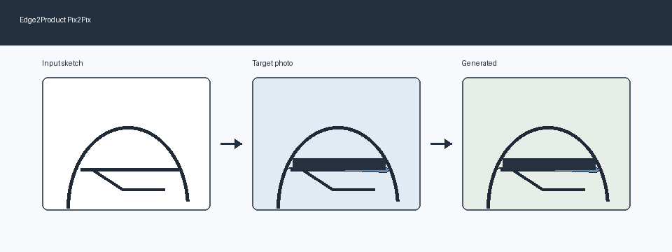

# Edge2Product: Sketch-to-Product Image Generation with Pix2Pix

Edge2Product is a course-level PyTorch project for translating shoe edge sketches into product-style shoe images with Pix2Pix / Conditional GAN. The repository is organized for coursework submission and GitHub presentation: it includes training, inference, evaluation, visualization, a Gradio demo, a two-column LaTeX report, and safe GitHub upload scripts.



## 1. Overview

This project implements an image-to-image translation system for the edges2shoes dataset. A U-Net generator maps an input edge sketch to a color shoe image, while a PatchGAN discriminator judges whether the paired sketch-image result is real or generated.

The repository keeps only the small `edges2shoes_100` subset and lightweight experiment outputs. The full dataset and large checkpoint files are intentionally excluded from git.

## 2. Demo

After training a model, launch the Gradio interface:

```bash
python demo_gradio.py \
  --checkpoint ./outputs/edge2shoes_100/checkpoints/latest_G.pth \
  --device cpu
```

The page lets a user upload an edge sketch, generate a product-style shoe image, and save the generated result to `outputs/gradio_results/`.

## 3. Motivation

Sketch-to-product generation is a practical image-to-image translation task. It can help designers and students prototype visual ideas from sparse contours. Pix2Pix is a suitable course baseline because it connects GAN training, supervised reconstruction, paired datasets, image preprocessing, model evaluation, and a user-facing demo in one compact pipeline.

## 4. Method

The model follows Pix2Pix:

- Generator: U-Net encoder-decoder with skip connections.
- Discriminator: PatchGAN classifier over local image patches.
- Loss: adversarial loss plus L1 reconstruction loss.

```text
G_loss = GAN_loss + lambda_L1 * L1_loss
```

The default `lambda_L1` is `100`.

## 5. Project Structure

```text
edge2product-pix2pix/
- README.md
- requirements.txt
- .gitignore
- train.py
- infer.py
- evaluate.py
- demo_gradio.py
- make_subset.py
- run_experiment.py
- configs/
- models/
- datasets/
- utils/
- scripts/
- report/
- assets/
- data/edges2shoes_100/
- outputs/edge2shoes_100/
```

The public repository excludes `docs/`, the full `data/edges2shoes` dataset, virtual environments, and model checkpoints.

## 6. Installation

```bash
pip install -r requirements.txt
```

For GPU training, install a PyTorch build that matches your CUDA version from the official PyTorch installation page.

## 7. Dataset Preparation

Download edges2shoes:

```bash
bash scripts/download_edges2shoes.sh
```

Create a small subset:

```bash
python make_subset.py \
  --dataroot ./data/edges2shoes \
  --sample_size 100 \
  --output_root ./data/edges2shoes_100
```

For the default `AtoB` direction, the left half of each paired image is treated as the edge sketch and the right half as the target product image.

## 8. Training

```bash
python train.py \
  --dataroot ./data/edges2shoes_100 \
  --save_dir ./outputs/edge2shoes_100 \
  --epochs 5 \
  --batch_size 1 \
  --lr 0.0002 \
  --lambda_l1 100 \
  --img_size 256 \
  --direction AtoB \
  --device cuda
```

Training writes `loss.csv`, sample visualizations, and checkpoints under `outputs/edge2shoes_100/`.

## 9. Inference

```bash
python infer.py \
  --dataroot ./data/edges2shoes_100 \
  --checkpoint ./outputs/edge2shoes_100/checkpoints/latest_G.pth \
  --save_dir ./outputs/edge2shoes_100/inference \
  --img_size 256 \
  --direction AtoB \
  --device cuda \
  --num_images 20
```

Inference outputs generated images and an input / target / generated comparison grid.

## 10. Evaluation

```bash
python evaluate.py \
  --generated_dir ./outputs/edge2shoes_100/inference/generated \
  --target_dir ./outputs/edge2shoes_100/inference/target \
  --save_path ./outputs/edge2shoes_100/metrics/metrics.json
```

The evaluator computes Mean L1, PSNR, and SSIM. It also writes `metrics.md`.

## 11. Gradio Web UI

```bash
python demo_gradio.py \
  --checkpoint ./outputs/edge2shoes_100/checkpoints/latest_G.pth \
  --device cpu
```

The demo supports CPU inference and saves user-generated outputs under `outputs/gradio_results/`.

## 12. Experiment Results

The included CPU experiment used 100 training pairs for 5 epochs and evaluated 20 validation pairs.

| Metric | Value |
| --- | ---: |
| Mean L1 | 0.3447 |
| PSNR | 7.0762 |
| SSIM | 0.3414 |

Artifacts included in the repository:

- `outputs/edge2shoes_100/logs/loss.csv`
- `outputs/edge2shoes_100/curves/loss_curve.png`
- `outputs/edge2shoes_100/samples/`
- `outputs/edge2shoes_100/inference/`
- `outputs/edge2shoes_100/metrics/metrics.json`

## 13. Report

Compile the two-column Chinese LaTeX report:

```bash
bash scripts/compile_report.sh
```

The source is `report/report.tex`, and the compiled PDF is `report/report.pdf`.

## 14. Reproduce Everything

```bash
bash scripts/run_all.sh
```

This script checks the dataset, runs the small experiment, plots losses, compiles the report, and prints final artifact paths.

## 15. Upload to GitHub

For normal Git + GitHub CLI environments:

```bash
bash scripts/push_to_github.sh
```

For Windows machines that have GitHub CLI but do not have Git installed:

```powershell
powershell -ExecutionPolicy Bypass -File scripts/publish_to_github_api.ps1
```

Both upload paths avoid storing tokens in the project. The repository includes small sample data and lightweight results, but not the full dataset or large checkpoint files. If trained weights need to be shared later, upload them to GitHub Releases, Hugging Face, Google Drive, or another file hosting service.


## 16. Limitations

- Small-sample GAN training is unstable.
- L1 reconstruction can produce smooth textures.
- Pix2Pix requires paired training images.
- CPU experiments validate the pipeline but do not produce strong visual quality.

## 17. Future Work

- Train with more edges2shoes samples and longer schedules.
- Add perceptual loss or feature matching loss.
- Try spectral normalization for the discriminator.
- Compare Pix2Pix against CycleGAN, CUT, or diffusion-based image translation methods.
- Package checkpoints through GitHub Releases or Hugging Face.

## 18. References

- Goodfellow et al., Generative Adversarial Nets, 2014.
- Isola et al., Image-to-Image Translation with Conditional Adversarial Networks, CVPR 2017.
- Zhu et al., Unpaired Image-to-Image Translation using Cycle-Consistent Adversarial Networks, ICCV 2017.
- PyTorch documentation.
- Gradio documentation.

## 19. License

This repository is provided as a course and portfolio project template. Add a formal open-source license before public release if needed.
